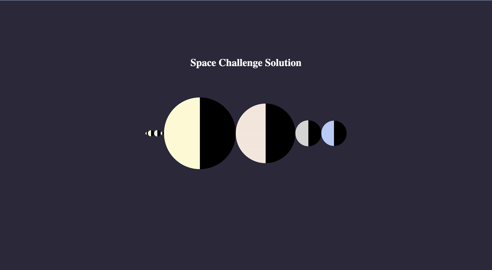

# Scrimba Challenge Week - Outer Space - Day 1 Space Challenge

This is a Scrimba Challenge [Event Info](https://scrimba.com/learn/codeweeks/day-1-render-solar-system-coeef4e6b9fe4b5ef3d71c6be). 

## Table of contents 😌

- [Overview](#overview)
  - [The project](#the-project)
  - [Screenshot](#screenshot)
  - [Links](#links)
- [My process](#my-process)
  - [Built with](#built-with)
  - [What I learned](#what-i-learned)
  - [Continued development](#continued-development)
  - [Code snippets](#im-really-proud-of-these-code-snippets%EF%B8%8F)
  - [Useful resources](#useful-resources)
- [Author](#author)
- [Acknowledgments](#acknowledgments)

## Overview👋🏾

Welcome to Day 1 of this Scrimba Challenge Week! This week's theme is Outer Space

### The project😥

Here are the tasks to be completed:

- Write a function to render the planets from the planets array using JavaScript.

Stretch goals:
- 1. Show planet facts on hover
- 2. Make one side of the planets dark (you can do this with one CSS property!)

### Screenshot🌇



### Links👩🏾‍💻

- Live Site URL: (https://scrimba.com/scrim/co9d5445e99553e345b65fbae)
  - Click the green "run" button to view

## My process💭

This is was a project that required lots of logical thinking. I began by creating a function that would loop through the planets array and:
- create a div
- add a class of 'planet' (from source css)
- add padding from the diameter element of the array (which displays the planets relative sizes)
- add a border-radius to change the shape of each planet from square to circular
- add all of this to the main element
- add a linear gradient to make one side of the planets black

### Built with👷🏾‍♀️

- Semantic HTML5 markup
- CSS custom properties
- Flexbox
- JavaScript

### What I learned👩🏾‍🏫

I learned how to use the style property to manipulate the inline style of the HTML elements from JavaScript.

### Continued development🔮

I also plan on continuing to practice using event listeners to make my pages more functional. I will later use this method to show planet facts on hover.

### I'm really proud of these code snippets✂️

```js
function renderSS() {
    planets.forEach(planet => {
        const planetElem = document.createElement("div")
        const planetDiam = planet.diameter
        planetElem.classList.add = 'planet'
        planetElem.style.padding = `${planetDiam * 0.001}px`
        // - Stretch goal #2. Make one side of the planets dark (you can do this with one CSS property!)
        planetElem.style.backgroundImage = `linear-gradient(
            to left, 
            #000 0%, 
            #000 50%, 
            var(--${planet.color}) 50%, 
            var(--${planet.color}) 100%`
        planetElem.style.borderRadius = '50%'
        solarSystem.appendChild(planetElem)
    })
}

renderSS()
```

### Useful resources📖

- [Resource](https://www.javascripttutorial.net/javascript-dom/javascript-style/) - This is an amazing article which helped learn how to inline style HTML elements from JavaScript. It also includes a list of common CSS Properties and how to access them via JavaScript.

## Author🔎

- Website - [Portfolio Site](https://www.maiannethornton.com/Portfolio/index.html)
- Frontend Mentor - [@MaianneThornton](https://www.frontendmentor.io/profile/MaianneThornton)
- GitHub - [@MaianneThornton](GitHub.com/MaianneThornton)
- Twitter - [@MaianneThornton](https://twitter.com/MaianneThornton)
- LinkedIn - [@MaianneThornton](https://www.linkedin.com/in/maiannethornton/)

## Acknowledgments🙏🏾

Special Thanks go to [Leanne Rybintsev](https://scrimba.com/teachers/uZqevktb) for creating this challenge!
